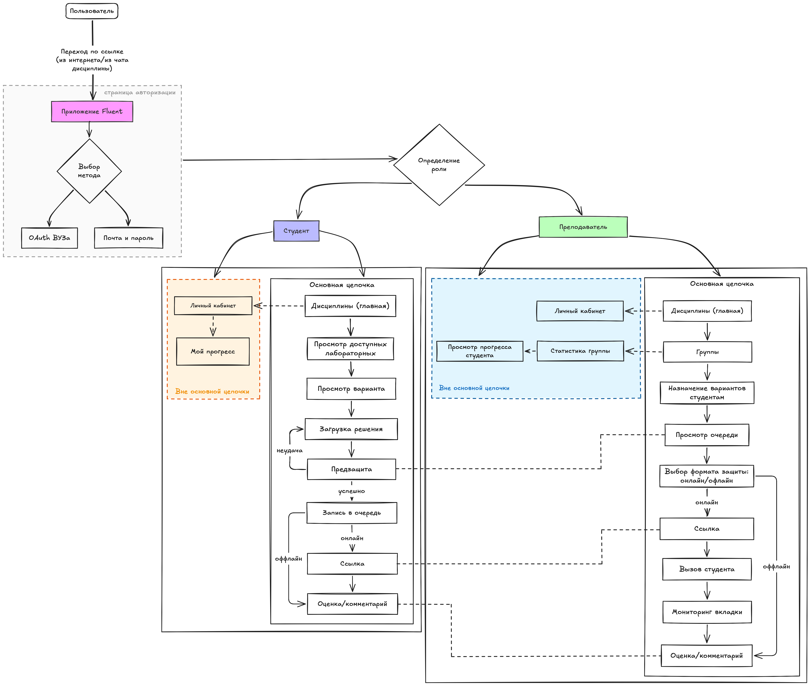

# Fluent documentation

## Архитектура приложения

Подробную схему и описание архитектуры приложения можно посмотреть [тут](./docs/app-architecture.md)

## Макеты интерфейса

Макеты всех ключевых экранов лежат [тут](./docs/mock-ups).

## Data flow diagram

DF-диаграмму можно посмотреть [тут (.svg)](docs/dfd/fluent_dfd.svg)

DF-диаграмму можно посмотреть [тут (.png)](docs/dfd/fluent_dfd.png)

## Presentation

Презентацию проекта можно посмотреть [тут](docs/presentation.pdf)

## User Flow

